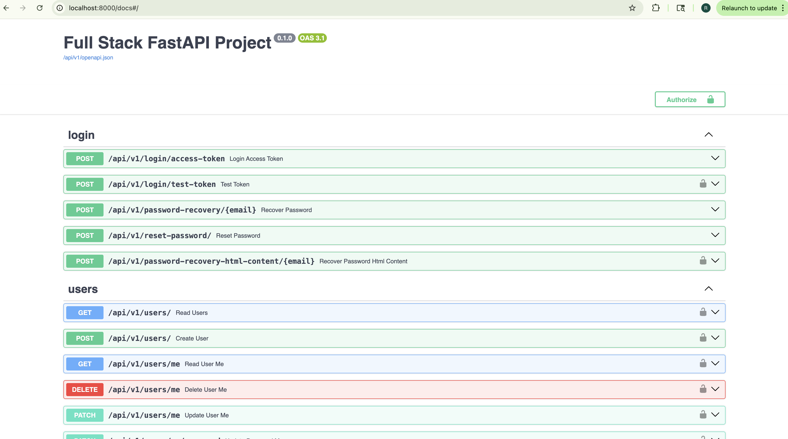

# Insurance Broker Platform

**Author:** Rajkumar Rajendran  
**Date:** 2025-01-23  
**Status:** Step 1 complete ✅ — stack running locally

## Overview
A minimal insurance broker back-end built on the FastAPI full-stack template.
Adds semantic policy search via pgvector and an LLM-powered agent that recommends
policies based on natural-language client queries.

---

## Tech Stack
- **Framework:** FastAPI + SQLModel
- **Database:** PostgreSQL 18 + pgvector (compiled from source)
- **Migrations:** Alembic
- **Embedding model:** Google `gemini-embedding-001` — free tier, strong NZ English comprehension
- **LLM:** Google `gemini-3-flash-preview` — free tier, supports function calling
- **Container:** Docker Compose

---

## How to Run Locally

### Prerequisites
- Docker Desktop (running)
- Gemini API key — get free at https://aistudio.google.com

### Steps
```bash
git clone https://github.com/r7rajkumar/full-stack-fastapi-template.git
cd full-stack-fastapi-template

# Copy env file and fill in your values
cp .env.example .env
# Edit .env: set GEMINI_API_KEY, SECRET_KEY, FIRST_SUPERUSER_PASSWORD, POSTGRES_PASSWORD

# Start the stack
docker compose up -d --build

# Run migrations
docker compose exec backend alembic upgrade head

# Seed data
docker compose exec backend python app/seed.py

# Generate embeddings
TOKEN=$(curl -s -X POST http://localhost:8000/api/v1/login/access-token \
  -H "Content-Type: application/x-www-form-urlencoded" \
  -d "username=admin@example.com&password=YOUR_PASSWORD" \
  | python3 -c "import sys,json; print(json.load(sys.stdin)['access_token'])")

curl -X POST http://localhost:8000/api/v1/policies/reindex \
  -H "Authorization: Bearer $TOKEN"
```

API available at: http://localhost:8000  
Swagger docs at: http://localhost:8000/docs

---

## Environment Variables
Copy `.env.example` to `.env` and fill in:

| Variable | Description |
|---|---|
| `GEMINI_API_KEY` | Your Google Gemini API key from aistudio.google.com |
| `SECRET_KEY` | Any long random string |
| `FIRST_SUPERUSER` | Admin email (default: admin@example.com) |
| `FIRST_SUPERUSER_PASSWORD` | Admin password |
| `POSTGRES_PASSWORD` | Database password |

---

## Domain Models

### Client
Represents an insurance client/business.
- `id`, `name`, `industry`, `annual_turnover_nzd`, `notes`

### Policy
Represents an insurance product offered by an insurer.
- `id`, `product_type`, `insurer`, `sum_insured_nzd`, `description`, `embedding`
- The `embedding` column stores a 768-dimension vector generated from the policy description

### Quote
Represents a premium quote linking a client to a policy.
- `id`, `client_id`, `policy_id`, `premium_nzd`, `status` (draft/sent/accepted)

---

## pgvector Design Decision
The embedding column is stored directly on the `Policy` table rather than a separate
`PolicyEmbedding` table. For this scale (10-20 policies) this is simpler and avoids
joins. At larger scale a separate table would allow re-embedding without schema changes.

---

## API Endpoints

### Auth
- `POST /api/v1/login/access-token` — get JWT token

### Clients
- `GET /api/v1/clients/` — list all clients
- `POST /api/v1/clients/` — create client
- `GET /api/v1/clients/{id}` — get client
- `PUT /api/v1/clients/{id}` — update client
- `DELETE /api/v1/clients/{id}` — delete client

### Policies
- `GET /api/v1/policies/` — list all policies
- `POST /api/v1/policies/` — create policy
- `GET /api/v1/policies/{id}` — get policy
- `PUT /api/v1/policies/{id}` — update policy
- `DELETE /api/v1/policies/{id}` — delete policy
- `POST /api/v1/policies/reindex` — generate embeddings for all policies
- `GET /api/v1/policies/search/semantic?q=...&k=5` — semantic search

### Quotes
- `GET /api/v1/quotes/` — list all quotes
- `POST /api/v1/quotes/` — create quote
- `GET /api/v1/quotes/{id}` — get quote
- `PUT /api/v1/quotes/{id}` — update quote
- `DELETE /api/v1/quotes/{id}` — delete quote

### Agent
- `POST /api/v1/agent/ask` — ask the LLM agent a question

---

## Semantic Search Example

```bash
# Get token
TOKEN=$(curl -s -X POST http://localhost:8000/api/v1/login/access-token \
  -H "Content-Type: application/x-www-form-urlencoded" \
  -d "username=admin@example.com&password=YOUR_PASSWORD" \
  | python3 -c "import sys,json; print(json.load(sys.stdin)['access_token'])")

# Search
curl "http://localhost:8000/api/v1/policies/search/semantic?q=small+cafe+food+liability&k=3" \
  -H "Authorization: Bearer $TOKEN" | python3 -m json.tool
```

**Sample response:**
```json
[
    {
        "product_type": "public_liability",
        "insurer": "Vero Insurance NZ",
        "sum_insured_nzd": 2000000.0,
        "description": "Public Liability insurance protects your business...",
        "id": 1,
        "score": 0.353
    }
]
```

---

## Agent Example

```bash
curl -s -X POST http://localhost:8000/api/v1/agent/ask \
  -H "Authorization: Bearer $TOKEN" \
  -H "Content-Type: application/json" \
  -d '{"question": "Which of our policies best suits a small Auckland cafe with NZ$200k annual turnover?"}' \
  | python3 -m json.tool
```

**Sample response:**
```json
{
    "answer": "For a small Auckland café with an annual turnover of NZ$200,000, I recommend the following four insurance policies:\n\n### 1. Public & Products Liability\n* **Insurer:** Allianz NZ\n* **Sum Insured:** NZ$5,000,000\n* **Why it suits you:** Essential for any café serving food and drink to the public. Covers third-party injury and product liability in one policy.\n\n### 2. Hospitality Business Interruption\n* **Insurer:** QBE New Zealand\n* **Sum Insured:** NZ$1,000,000\n* **Why it suits you:** Specifically designed for cafés. Covers revenue loss from kitchen equipment failure with a seasonal adjustment clause for peak periods.\n\n### 3. Commercial Property\n* **Insurer:** Vero Insurance NZ\n* **Sum Insured:** NZ$3,000,000\n* **Why it suits you:** Covers your fit-out, kitchen equipment, and stock against fire, theft, and natural disasters.\n\n### 4. Employers Liability\n* **Insurer:** Zurich NZ\n* **Sum Insured:** NZ$1,000,000\n* **Why it suits you:** Protects against employee claims outside ACC scope including employment disputes.",
    "policies_consulted": []
}
```

---


## Deployment Approach

**Infrastructure (AWS):**
- **Container Registry:** Push backend and frontend Docker images to AWS ECR
- **Compute:** Deploy on ECS Fargate (serverless containers) — no EC2 management needed
- **Database:** AWS RDS PostgreSQL 18 with pgvector extension enabled via `CREATE EXTENSION vector` — RDS supports pgvector natively since 2023
- **Load Balancer:** ALB (Application Load Balancer) in front of ECS for TLS termination and routing
- **Secrets:** `GEMINI_API_KEY`, `SECRET_KEY`, `POSTGRES_PASSWORD` stored in AWS Secrets Manager — injected as environment variables into ECS task definitions at runtime
- **Networking:** VPC with private subnets for RDS and ECS tasks, public subnet for ALB only

**CI/CD:**
- GitHub Actions builds and pushes Docker images to ECR on every push to `main`
- ECS service auto-deploys new task definition when image updates


---

## What I'd Do Next (with another 2 hours)
- Add a vector index (`CREATE INDEX ON policy USING ivfflat (embedding vector_cosine_ops)`) for faster search at scale
- Move embeddings to a separate `policy_embedding` table so schema changes don't require re-embedding
- Add multi-turn conversation memory to the agent using Redis or Postgres message history
- Add `POST /agent/quote` endpoint to create a Quote record from the agent's recommendation
- Write smoke tests for the semantic search endpoint using pytest
- Auto-trigger reindex when a new policy is created via a FastAPI background task

---

## Loom Recording
https://loom.com/share/8f8777c2b5df4dceb4dd7eb2801d2144
